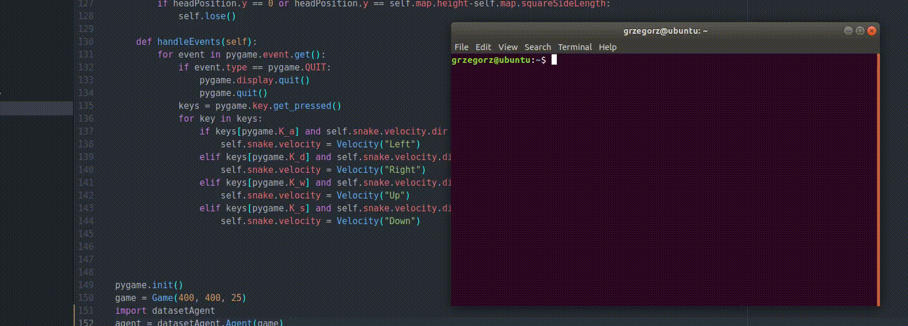

# artificialSnake
Snake game in python with different types of agents. 
  
   
Self learning agent learns on its own. Each step is added to a dynamic dataset and the move is predicted by a neural network. In the next step the previous step is evaluated by an evaluation function. Every generation learns only from those datapoints that were well evaluated (evaluation was higher than a threshold). Once per 4 generations 10% of the oldest datapoints is deleted. What's more if the neural network predicton has a low prediction probablility than the snake makes a random moves. Just like a human it can behave randomly and then learn from mistakes. 
  
   
Dataset agent was trained on a dataset created by me, it mimics my moves but cannot overcame entering places where there is not enough space and doom is brought to him in few next moves.

